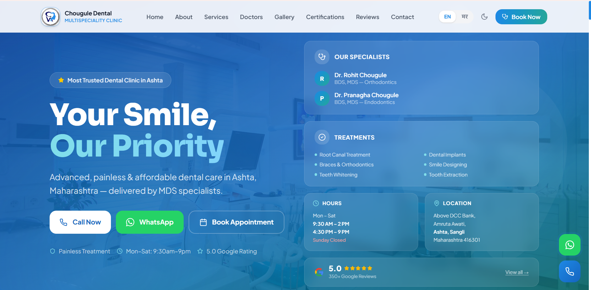
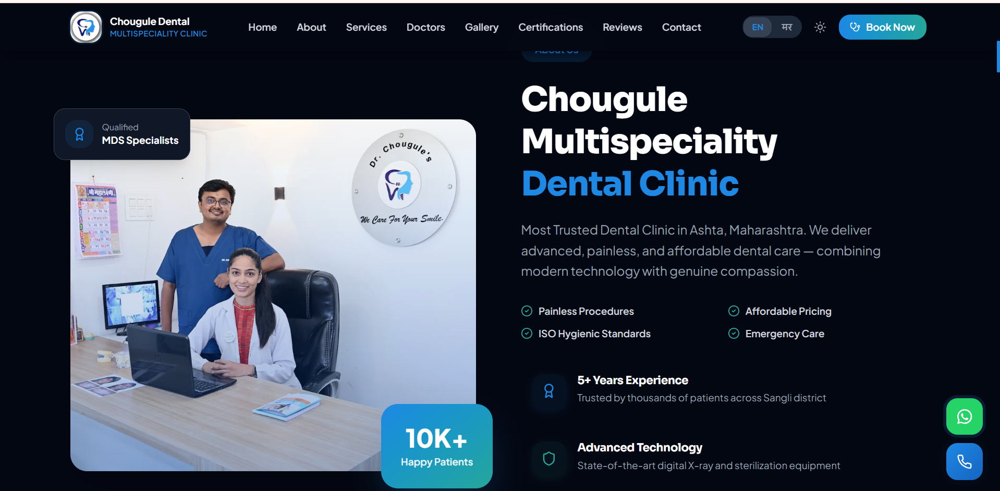
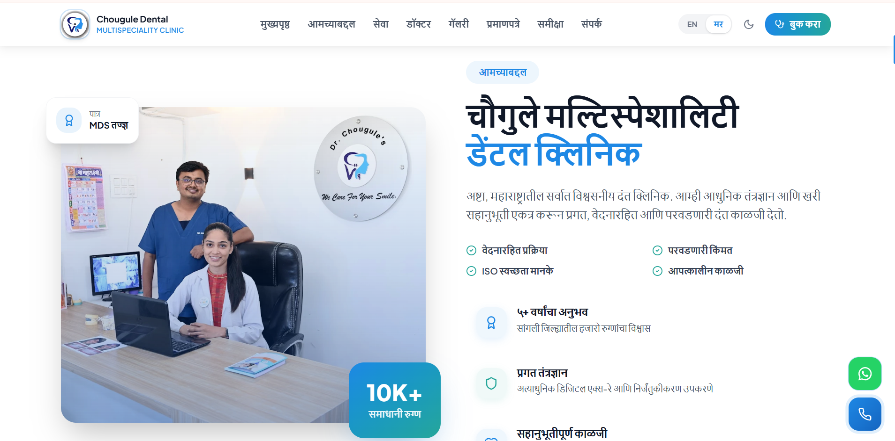
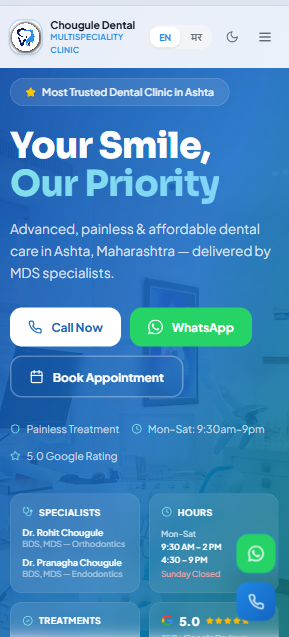
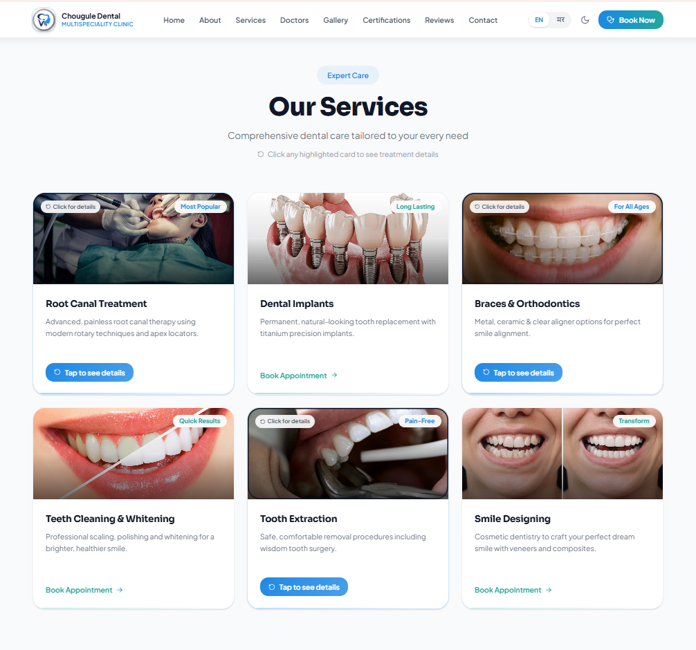
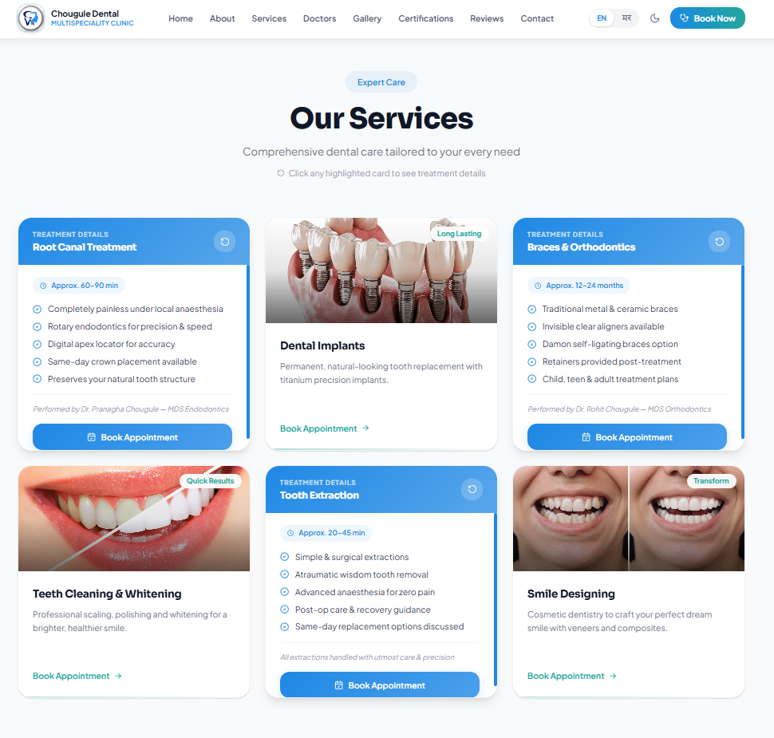
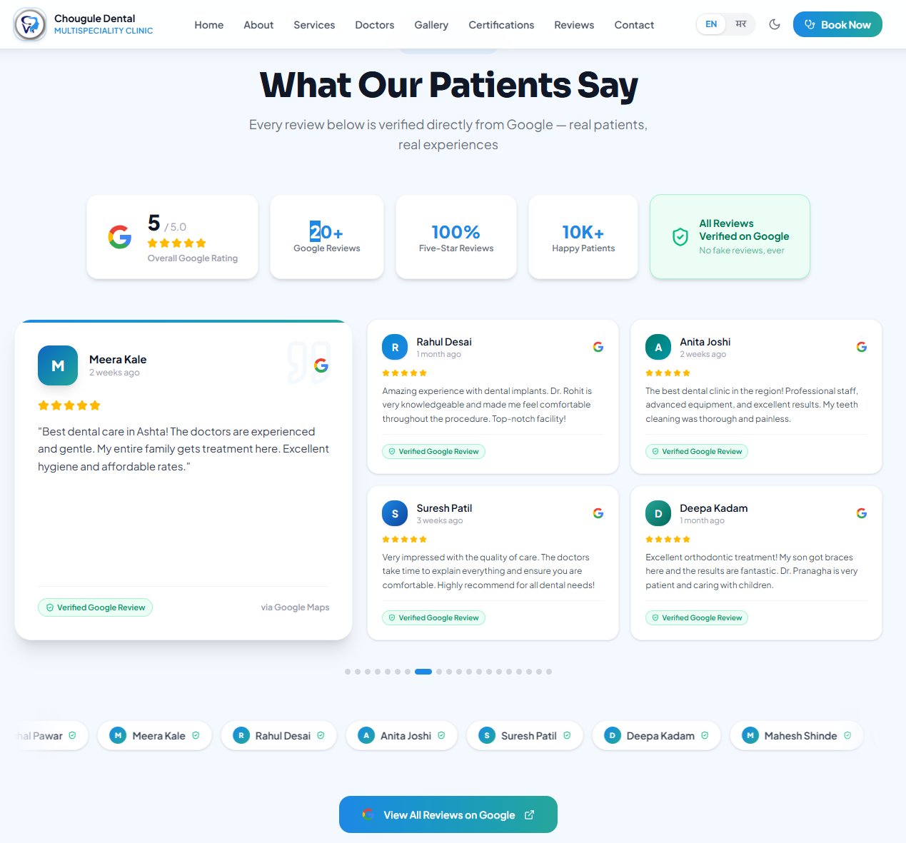
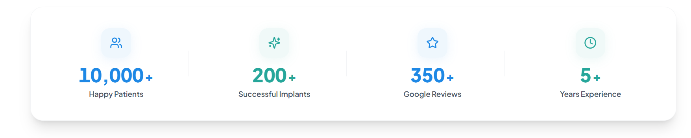
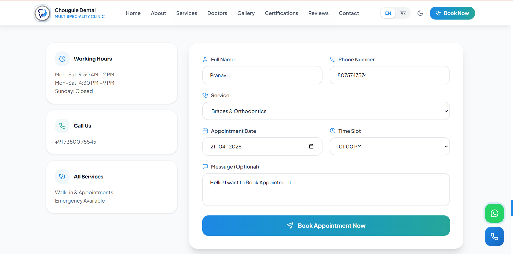
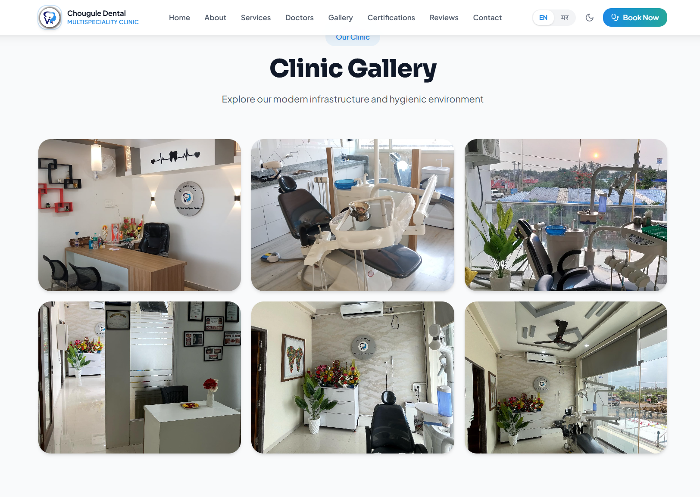

<div align="center">

# 🦷 Chougule Dental Clinic

### *Your Smile, Our Priority*

<p align="center">
  
  
  
  
  
</p>

<p align="center">
  A <strong>production-grade, bilingual, fully responsive</strong> dental clinic website.<br/>
  Dark / Light Mode · English & Marathi · EmailJS Booking · 3D Flip Cards · Verified Reviews
</p>

<p align="center">
  <a href="https://chouguledentalclinic1.pages.dev">
    
  </a>
  &nbsp;
  <a href="https://github.com/pranavreddy1721/dental">
    
  </a>
  &nbsp;
  <a href="mailto:pranavreddy1721@gmail.com">
    
  </a>
</p>

<br/>

---

</div>

## 📸 Preview

<div align="center">
  
  <br/><br/>
  <em>Chougule Dental Clinic — Live on Cloudflare Pages · Bilingual · Dark/Light Mode · Appointment Booking</em>
</div>

<br/>

---

## ✨ Features

<table>
<tr>
<td width="50%">

### 🌍 &nbsp;Bilingual Interface
- Full **English ↔ Marathi** switch — one click, no reload
- React Context API with 40+ translated strings
- Covers Navigation, Hero, About, Stats sections
- Pill-style language toggle in the navbar

</td>
<td width="50%">

### 🌙 &nbsp;Dark / Light Mode
- Smooth theme toggle with moon/sun icon
- **Persists** across sessions via `localStorage`
- Tailwind `dark:` classes throughout all components
- Matches clinic's blue-teal brand in both modes

</td>
</tr>
<tr>
<td width="50%">

### 📊 &nbsp;Animated Statistics
- Scroll-triggered counters using `IntersectionObserver`
- **10,000+** Happy Patients · **200+** Implants
- **350+** Google Reviews · **5+** Years Experience
- Cubic ease-out animation, ~2.2s duration

</td>
<td width="50%">

### 🃏 &nbsp;3D Flip Service Cards
- Click any highlighted card to **flip it 180°**
- Back face reveals: duration, 5-point checklist, doctor name
- 3 flip cards + 3 direct-book cards
- `preserve-3d` + `backface-visibility` CSS animation

</td>
</tr>
<tr>
<td width="50%">

### 📅 &nbsp;Appointment Booking
- **EmailJS** integration — no backend server needed
- Blocks Sunday dates with a real-time alert
- Auto-populates service from clicked card via `localStorage`
- Sends confirmation email to clinic Gmail instantly

</td>
<td width="50%">

### ⭐ &nbsp;Google Reviews
- Auto-cycling featured card (20 reviews · 4.5s interval)
- **2×2 clickable side grid** — click to promote to featured
- **Verified Google Review** green badge on every card
- Scrolling marquee strip of all 20 reviewer names

</td>
</tr>
<tr>
<td width="50%">

### 🖼️ &nbsp;Gallery & Certifications
- 6 real clinic photos in a responsive 3-column grid
- Full-screen **lightbox** overlay on click
- MDS degree certificates with **click-to-zoom** modal
- Lazy-loaded images for performance

</td>
<td width="50%">

### 📱 &nbsp;Fully Responsive
- Works from **320px mobile** to **1920px desktop**
- Dedicated mobile hero with 2-column info card grid
- Hamburger nav menu with smooth transitions
- Tested on Chrome, Firefox, Safari, and Android

</td>
</tr>
</table>

<br/>

---

## 🚀 Getting Started

No backend. No environment setup required.

```bash
# 1. Clone the repository
git clone https://github.com/pranavreddy1721/dental.git
cd dental

# 2. Install dependencies
npm install

# 3. Start the development server
npm run dev
```

> Open [http://localhost:5173](http://localhost:5173) in your browser.

### Build for Production

```bash
npm run build
# Output → dist/
```

<br/>

---

## 🖥️ Screenshots

### 🏠 Homepage — Desktop


---

### 🌙 Dark Mode


---

### 🌍 Marathi Language Active


---

### 📱 Mobile View


---

### 🃏 Services — Card Flip

**Front face — all 6 service cards:**


**After clicking — treatment details revealed:**


---

### ⭐ Google Reviews Section


---

### 📊 Animated Stats Counter


---

### 📅 Appointment Booking Form


---

### 🖼️ Clinic Gallery


<br/>

---

## 🗂️ Project Structure

```
Chougule-Dental-Clinic/
│
├── 📂 public/                       # Static assets
│   ├── Chougule_logo.jpg            # Clinic logo
│   ├── Dental_chair.jpg             # Gallery — real clinic photos
│   ├── clinic_reception.jpg
│   ├── Treatment_room.jpg  ...
│   ├── root_canal.jpg               # Service card images
│   ├── dental_implant.png  ...
│   └── mds-certificate.jpg          # Doctor MDS certificates
│
├── 📂 screenshots/                  # README screenshots (add yours here)
│
├── 📂 src/
│   ├── 📂 app/
│   │   ├── App.tsx                  # Root + LanguageContext (EN/MR)
│   │   ├── context/
│   │   │   └── ThemeContext.tsx     # Dark / Light mode
│   │   ├── hooks/
│   │   │   └── useCountUp.ts        # Scroll-triggered counter hook
│   │   └── components/
│   │       ├── Navigation.tsx       # Navbar — EN/MR toggle + dark mode
│   │       ├── Hero.tsx             # Hero + clinic info panel
│   │       ├── About.tsx            # About + animated stats bar
│   │       ├── StatsBar.tsx         # Reusable animated counters
│   │       ├── Services.tsx         # 3D flip service cards
│   │       ├── Doctors.tsx          # Doctor profiles
│   │       ├── WhyChooseUs.tsx      # USP section
│   │       ├── Reviews.tsx          # Google reviews + marquee
│   │       ├── Gallery.tsx          # Photo gallery + lightbox
│   │       ├── Certifications.tsx   # MDS certificates + zoom
│   │       ├── Appointment.tsx      # EmailJS booking form
│   │       ├── Contact.tsx          # Contact info + Google Maps
│   │       ├── FloatingButtons.tsx  # Fixed WhatsApp + Call buttons
│   │       └── Footer.tsx           # Footer with CTA strip
│   │
│   ├── styles/
│   │   ├── index.css                # Global styles + slick carousel
│   │   ├── theme.css                # CSS variables + dark mode tokens
│   │   ├── fonts.css                # Sora + Plus Jakarta Sans
│   │   └── tailwind.css             # Tailwind imports
│   │
│   └── main.tsx                     # React entry point
│
├── index.html
├── vite.config.ts
└── package.json
```

<br/>

---

## 🛠️ Tech Stack

<p align="center">
  
  &nbsp;
  
  &nbsp;
  
  &nbsp;
  
</p>
<p align="center">
  
  &nbsp;
  
  &nbsp;
  
  &nbsp;
  
</p>

| Technology | Purpose |
|---|---|
| **React 18 + TypeScript** | Component-based UI with full type safety |
| **Vite 6** | Lightning-fast dev server and production build |
| **Tailwind CSS 4** | Utility-first styling with custom theme tokens |
| **EmailJS** | Client-side email sending — no backend needed |
| **React Context API** | Theme (dark/light) and Language (EN/MR) state |
| **IntersectionObserver** | Scroll-triggered counter animations |
| **Cloudflare Pages** | Free CDN hosting with GitHub auto-deploy |
| **Google Maps Embed** | Live clinic location — no API key needed |
| **Lucide React** | Icon library — lightweight, tree-shakable |
| **React Slick** | Carousel for reviews section |

<br/>

---

## 🔧 Configuration

### 📧 EmailJS Setup

The appointment form sends emails via **EmailJS** — no backend required.

Credentials are in `src/app/components/Appointment.tsx`:

```typescript
emailjs.send(
  "service_qrumx55",      // ← EmailJS Service ID
  "template_908dksu",     // ← EmailJS Template ID
  templateParams,
  "2mDLcruOZfH0K_PBA"     // ← EmailJS Public Key
);
```

To use your own account → [emailjs.com](https://www.emailjs.com) → create service + template → replace the IDs above.

### 🌐 Live Google Reviews (Optional)

Add to Cloudflare Pages environment variables to fetch real reviews:

```env
VITE_GOOGLE_PLACES_API_KEY=AIza...
VITE_GOOGLE_PLACE_ID=ChIJ...
```

Without these, the site shows 20 curated fallback reviews — works perfectly.

<br/>

---

## 📦 Deployment

Deployed on **Cloudflare Pages** with automatic CI/CD from GitHub.

| Setting | Value |
|---------|-------|
| Build command | `npm run build` |
| Output directory | `dist` |
| Node.js version | `18.x` |

Every `git push` to `main` → Cloudflare auto-builds and deploys in ~60–90 seconds.

**Live →** [https://chouguledentalclinic1.pages.dev](https://chouguledentalclinic1.pages.dev)

<br/>

---

## 📱 Responsive Behaviour

| Screen | Layout |
|--------|--------|
| **Desktop (≥ 1024px)** | 2-column hero with clinic info panel on right |
| **Tablet (768px – 1023px)** | Single column, info cards below CTAs |
| **Mobile (≤ 767px)** | 2-column info card grid, hamburger nav |

<br/>

---

## 🔒 Privacy

The website is **100% client-side** for all user data:
- ✅ No patient data stored on any server
- ✅ Appointment form only sends to clinic's own Gmail
- ✅ No analytics or tracking scripts
- ✅ Works fully after initial CDN load

<br/>

---

## 🤝 Contributing

Contributions, issues and feature requests are welcome!

```bash
# Fork the repo, create a branch, make changes, open a PR
git checkout -b feature/your-feature-name
git commit -m "feat: add your feature"
git push origin feature/your-feature-name
```

**Ideas for contributions:**
- Patient testimonial video section
- Before/after smile gallery slider
- Razorpay payment gateway for consultation fees
- Schema.org DentalClinic structured data for SEO
- Firebase backend for appointment management

<br/>

---

## 📄 License

```
MIT License — free to use, modify, and distribute.
```

<br/>

---

<div align="center">

**Made with ❤️ for Chougule Dental Clinic, Ashta, Maharashtra**

<br/>

*Chougule Dental Clinic — Your Smile, Our Priority*

<br/>

[](https://github.com/pranavreddy1721/dental)

</div>
